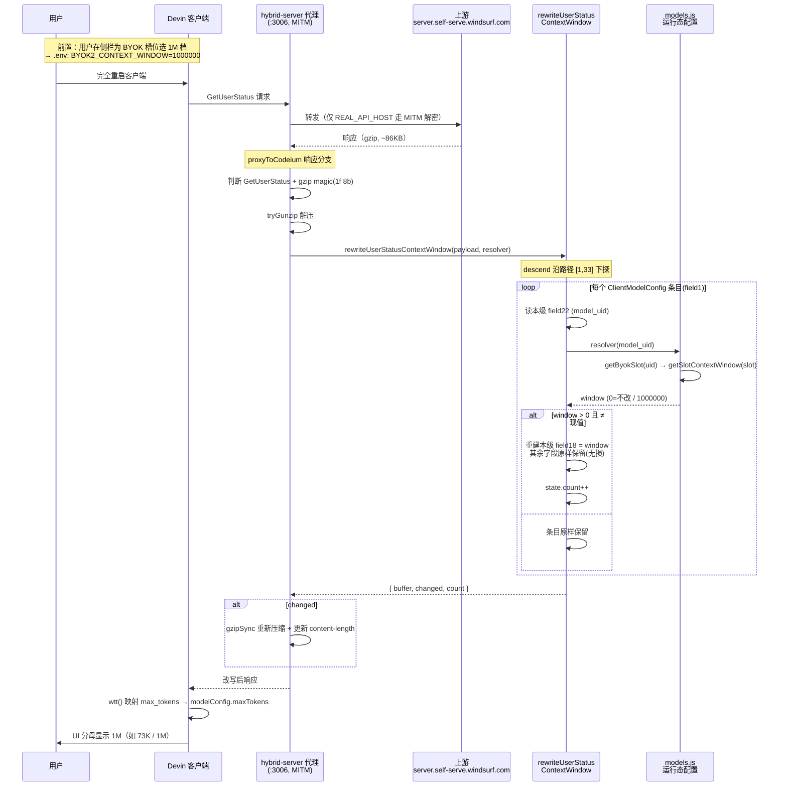

# BYOK 上下文窗口分母显示修复 — 设计文档

- **日期**: 2026-07-09
- **分支**: `fix/byok-context-window-display`
- **状态**: 已实现并真机验证通过（UI 分母正确显示 1M，实测 `73K / 1M`）
- **前置文档**: [`2026-07-09-configurable-context-window-design.md`](./2026-07-09-configurable-context-window-design.md)

## 背景

前置文档 `feat/configurable-context-window` 实现了"按 BYOK 槽位配置上下文窗口档位"，改写目标是 `GetUserStatus` 响应里模型条目的 `field4`（context_window）。但在当前 Devin 版本上，无论怎么改 `field4`，UI 分母始终显示 200K。

本文档记录对该问题的重新定位与修复：**UI 分母的真正来源不是 `field4`，而是同一条 `ClientModelConfig` 本级的 `field18`（max_tokens）**。同时厘清了一个极具迷惑性的"改写成功但 UI 不变"假象——其真正原因是**客户端缓存**。

## 根因（已重新确认）

### 1. UI 分母来源是 `field18`，不是 `field4`

从客户端 bundle 挖出的 proto 定义（`typeName = exa.codeium_common_pb.ClientModelConfig`）：

| field | 名称 | 类型 | 说明 |
|---|---|---|---|
| 1 | `label` | string | 如 `Claude Opus 4 Thinking BYOK` |
| 18 | `max_tokens` | int32 | **UI 上下文分母真正读取的字段** |
| 22 | `model_uid` | string | 如 `MODEL_CLAUDE_4_OPUS_THINKING_BYOK`，用于匹配 BYOK 槽位 |
| 23 | `model_info` | message | 子消息，内部另有 `context_window`（旧方案的 `field4` 目标），但 UI **不读它** |

客户端映射函数 `wtt(p)` 把 proto 对象映射为 UI modelConfig，明确 `maxTokens: p.maxTokens`；UI 分母 `contextLimit` 读的就是 `currentModelConfig.maxTokens`。因此改 `field23.field4` 完全打偏。

### 2. payload 结构与嵌套路径

UI 的模型列表实际来自 `GetUserStatus` 大 payload（约 86KB，gzip），而非 `GetCascadeModelConfigs` 等专门 RPC（实测这些 RPC 从不流经代理）。

```
顶层
└─ field1  (msg)
   └─ field33 (msg)
      └─ field1 (repeated msg)   ← 每个元素是一个 ClientModelConfig（共 151 个）
         ├─ field1  = label       (string)
         ├─ field18 = max_tokens  (int32, 200000)   ← 改这里
         ├─ field22 = model_uid   (string)          ← 按这里匹配
         └─ field23 = model_info  (msg, 内含 context_window)
```

抓包确认四个 BYOK 条目本级 `field18` 全为 `200000`，靠 `field22`（model_uid 字符串）标识。

### 3. 客户端缓存 GetUserStatus（关键迷惑点）

改写在网络层**确实成功**（日志 `rewrite count=2`，两个 Opus 的 field18 已 200000→1000000），但只"新建会话"时 UI 仍显示 200K。原因是**客户端缓存了旧的 GetUserStatus payload，新建会话不重新拉取**。

**完全重启客户端**后重新拉取，label 和分母同时生效——这也构成了下节的决定性验证。

## 定位过程中的决定性实验

为区分"改错字段"与"改错数据源"，加了一个临时 label 探针（`DEBUG_LABEL_PROBE`）：把命中条目的 `field1`（label）也追加 `[1M]` 后缀。

- **若模型名变了** → 客户端确实读这份 payload，问题在字段
- **若模型名没变** → 客户端根本不用这份 payload

结果：完全重启后模型名变为 `Claude Opus 4 Thinking BYOK [1M]`，分母同步变为 `73K / 1M`。**一次性证明**：字段（field18）、数据源（GetUserStatus）、匹配（model_uid）全部正确，之前的失败纯粹是缓存导致。验证后该探针已移除。

## 与旧方案的差异对比

| 维度 | 旧方案（configurable 文档） | 本次修复 |
|---|---|
| 嵌套路径 | `[1, 33, 1]` → `field23` repeated | `[1, 33]` → `field1` repeated |
| 改写目标 | `field23.field4`（context_window） | 本级 `field18`（max_tokens） |
| 条目匹配 | `field1` 数值 ID（277/278/279/280） | `field22` model_uid 字符串 |
| resolver 入参 | `(modelId: number)` | `(modelUid: string)` |
| 结果 | UI 不变（打偏） | UI 正确显示 |

## 改写执行时序图



## 改写算法（无损重建）

```
rewriteUserStatusContextWindow(decoded, resolver):
  descend(decoded, path=[1,33]):
    fields = parseWithRaw(buf)          # 每字段保留原始字节 raw
    重编每个 field:
      - 若 field 号 == path 首元素(中间节点, wireType2):
          inner = descend(f.value, path[1:])
          writeBytesField(f.field, inner)   # 父级 length 自动重算
      - path 走完(到达 repeated field1 层):
          对每个 field1 条目 → rewriteModelEntry
      - 其余字段: 用 f.raw 原样重编(无损)

  rewriteModelEntry(entryBuf, resolver):
    读本级 field22 (model_uid)
    window = resolver(model_uid)
    若 window <= 0: 返回 null(原样保留)
    重编条目字段:
      - field18(max_tokens) 且值 ≠ window → writeVarintField(18, window)
      - 其余字段 → f.raw 原样保留
    若原条目无 field18 → 追加一个
```

### 无损关键

- `parseWithRaw` 为每个字段保留完整原始字节（tag+value），未改字段原样重编，保证无损 round-trip。
- `writeBytesField` 内部按新长度写 length 前缀，变长自动沿链传播，无需手工算偏移。
- `200000 → 1000000` 恰好都是 3 字节 varint（`C0 9A 0C` → `C0 84 3D`），当前档位下 payload 长度不变；但算法按变长正确处理，未来加档位无需改代码。

## 涉及文件

| 文件 | 改动 |
|---|---|
| `src/proxy/handlers/context-window-rewrite.js` | 路径改 `[1,33]`；`rewriteModelEntry` 改为按 `field22` 匹配、改写 `field18`；resolver 入参改为 model_uid 字符串 |
| `src/proxy/hybrid-server.js` | resolver 换为 `resolveContextWindowByModelUid`；调用点传入新 resolver |

> `byok-slots.js` 的 `BYOK_SLOT_BY_REQUEST`（model_uid → 槽位）与 `models.js` 的 `getSlotContextWindow` 均直接复用，无需改动。

## 错误处理与边界

- **顶层 try/catch**：改写异常 → `{ changed: false }`，回传原始未解压字节，永不破坏响应。
- **changed 门控**：仅真正命中才 gzipSync 重压；无命中直接透传原 gzip 字节（零开销）。
- **gzip magic 校验**：仅 `1f 8b` 开头才进改写路径。
- **未命中即跳过**：`resolver` 返回 0（槽位未配或非 BYOK 模型）时条目原样保留。
- **幂等**：反复经过不累积副作用。

## 运维注意事项

- **必须完全重启客户端**才能看到分母变化。仅新建会话不会重新拉取 `GetUserStatus`，会读到缓存的旧值。
- 运行副本路径 `C:\Users\<user>\.windsurf\extensions\jornlin.devin-byok-plus-<ver>\proxy-scripts\src\`（扁平结构）；改工作区源码后需同步到运行副本才生效。

## 教训

1. **验证字段来源要基于客户端实际读取路径**，而非同名/相邻字段。旧方案的 `field4` 名字对（context_window），但 UI 不读它。
2. **"改写成功但 UI 不变"要先排除缓存**，再怀疑改写逻辑。本次因误判为改写未生效，绕了很大弯路。
3. **label 探针**是区分"改错字段"与"改错数据源"的高性价比手段——让一个必然可见的字段（模型名）跟着变，一次实验就能定位。
