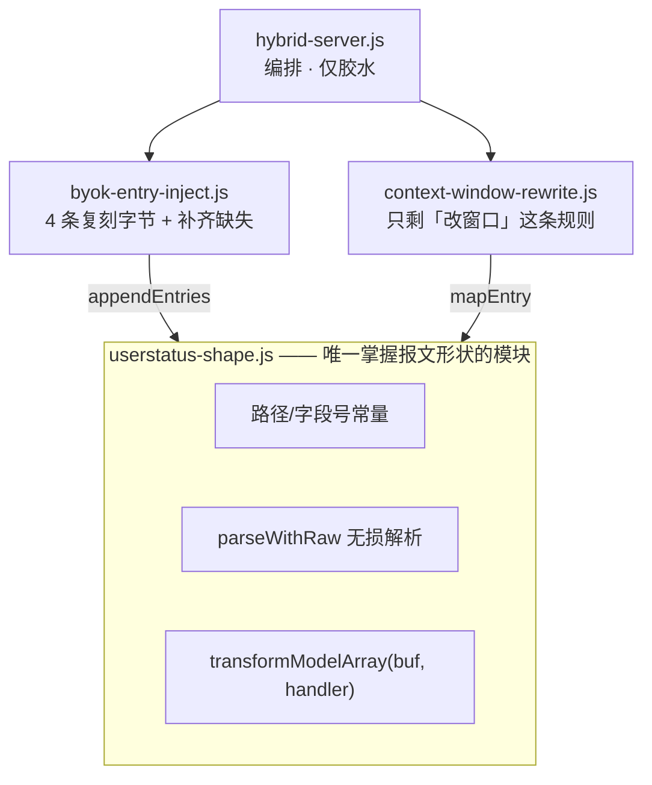

# BYOK 模型条目注入 — 设计文档

- **日期**: 2026-07-31
- **状态**: 设计已确认，待实现
- **前置证据**: 已通过一次性诊断探针采集当前 `GetUserStatus` 载荷并与 2026-07-09 载荷逐条比对

## 背景

2026-07-31 起，Devin 模型下拉列表中四个 BYOK 条目（`Claude Opus 4 BYOK` 等）整条消失，连 `Pro` 灰显都没有。此前该账号（免费档）可正常选中并使用这些槽位，用量统计可证。

排查过程排除了三个候选原因：

| 候选 | 排除依据 |
|------|---------|
| 客户端补丁失效 | P1/P2/P3 三处补丁均在位，URL 指向 `127.0.0.1:3006` |
| 协议/接口变更 | 新客户端 protobuf 枚举 277~280 完好，字段号未变 |
| 账号掉档 / BYOK 属付费权益 | 2026-07-09 同一免费账号拿到全部 4 条 BYOK 条目 |

## 根因（已确认）

服务端模型目录整体改版，BYOK 条目被下架。

```
当前载荷条目数: 193        (2026-07-09: 151)
当前 BYOK 条目数: 0        (2026-07-09: 4)

消失 27 条: 4×BYOK、GPT-5 Codex 全家、MODEL_SWE_1_5、opus-4-7-*-fast
新增 69 条: claude-opus-5-*、gpt-5-6-sol/luna、gemini-3-6-flash-*、kimi-k3、adaptive
```

新模型批量上架的同一批变更中移除了 BYOK 条目。

### f24 是可用性门控字段

193 个样本零反例：

```
有 f24 的条目: 1 / 193
   f24=1  swe-1-6-slow  | SWE-1.6 Slow      ← UI 中唯一可选项
其余 192 条无 f24                            ← UI 中全部 Pro 灰显
```

2026-07-09 载荷中 `swe-1-6-slow` 为 `f24=1`、四条 BYOK 为 `f24=4`，两者当时均可用。故 f24 语义为「用户通过何种途径获得访问权」（1=免费档，4=BYOK 自带 key），字段缺失即无权访问。

**推论**：原样回放带 `f24=4` 的 BYOK 条目，应渲染为可选而非灰显。

## 目标与非目标

**目标**：在代理层向 `GetUserStatus` 响应补回四条 BYOK 条目，使下拉列表恢复可选，选中后经既有槽位路由走用户自己的网关。

**非目标**：不恢复其他下架模型；不改动客户端 bundle；不绕过任何服务端计费或鉴权（BYOK 请求本就由代理截走，不消耗官方额度）。

## 关键设计决策

| 决策 | 选择 | 理由 |
|------|------|------|
| 条目内容 | 复刻 2026-07-09 抓包字节原样回放 | 最接近已验证可用状态；`f23` 是 105B 嵌套配置，手工重建易错 |
| 目标集合 | 恒为全部 4 条，不因槽位是否配置而增减 | 与历史状态完全一致，行为可预测 |
| 逐条去重 | 目标集合中，仅补服务端未下发的 uid | 服务端恢复下发后自动让路，天然幂等 |
| 上下文窗口 | 注入时保留 `max_tokens=200000`，交由既有改写逻辑处理 | 窗口规则保持单一来源 |
| 形状知识归属 | 抽独立模块，注入与改窗口共用 | 两个 transform 依赖同一份报文形状，该知识只应有一个归属 |

## 架构

现状问题：报文形状知识（路径 `[1,33]`、字段号、无损遍历）private 于 `context-window-rewrite.js`。注入需要同一份知识，复制或塞入改写器都不合适。



### handler 接口

`transformModelArray(buf, handler)` 的 `handler` 是对象，只提供以下两个键之一：

```js
{
  // 逐条改写：对每个条目调用，返回 null = 原样保留（context-window-rewrite 用）
  mapEntry: (entryBuf, modelUid) => Buffer | null
}

{
  // 数组级补齐：遍历完成后调用一次，返回待追加的 payload 数组（byok-entry-inject 用）
  appendEntries: (existingUids) => Buffer[]
}
```

两键同时提供时视为契约违用，直接抛错——避免出现「先改写后追加」这类隐式顺序依赖。

## 数据流

```
Devin ──GetUserStatus──▶ hybrid-server（非流式分支）
   gzip magic 1f8b ──▶ tryGunzip
                          ▼
   ① injectMissingByokEntries      服务端未发该 uid 才补，复刻字节含 max_tokens=200000
                          ▼
   ② rewriteUserStatusContextWindow  既有逻辑，把注入条目的 200000 → 1000000
                          ▼
   任一 changed ──▶ gzipSync ──▶ 回传
   都没变       ──▶ 原 gzip 字节透传（零开销）
```

**为何分两趟而非单趟合并**：注入条目原样带 `max_tokens=200000`，随后交给既有改窗口逻辑处理。这样「注入进来的」与「服务端本来就发的」走完全相同的后续路径，`BYOK{N}_CONTEXT_WINDOW` 自动生效。合并成单趟会让两件事的失败模式纠缠在同一个 `changed` 标志里——补齐失败意味着列表缺项，改写失败意味着窗口不对，两者需要分别可诊断。

两趟各解析一次 110KB；该 RPC 低频，代价可忽略。

## 模块职责

### 1. `src/proxy/handlers/userstatus-shape.js`（新建）

- 常量：`MODEL_ARRAY_PATH = [1, 33]`、`CMC_ENTRY_FIELD`、`CMC_MODEL_UID_FIELD` 等
- `parseWithRaw(buf)` — 保留每字段原始字节，支撑无损 round-trip
- `transformModelArray(buf, handler) → { buffer, changed, count }`
- 依赖：`proto.js`

### 2. `src/proxy/handlers/byok-entry-inject.js`（新建）

- 内联 4 条 base64 payload 常量 + 字段表注释（标注来源日期与各字段含义）
- `injectMissingByokEntries(decoded) → { buffer, changed, count }`
- 模块加载时自检各 payload 可解析；失败者剔除并记一次日志
- 依赖：模块 1

### 3. `src/proxy/handlers/context-window-rewrite.js`（改造）

- 删除私有 `parseWithRaw` / `descend`，改用模块 1 的 `transformModelArray`
- 保留 `rewriteModelEntry` / `rewriteModelInfo` 作为 `mapEntry` handler
- 对外签名不变，既有测试应全绿

### 4. `src/proxy/hybrid-server.js`（改造）

- `GetUserStatus` 分支内串联 ① → ②，任一 `changed` 则重压
- 仅胶水，无业务逻辑

## 复刻数据

四条 payload 字段结构（以 OPUS 为例）：

```
f1  = "Claude Opus 4 BYOK"        label
f18 = 200000                       max_tokens（交由 ② 改为 1M）
f22 = "MODEL_CLAUDE_4_OPUS_BYOK"   路由键，代理靠它匹配槽位
f23 = <opaque 105B>                model_info，内含 f4=context_window
f24 = 4                            ★ 门控字段，193 样本证实：有=可选，无=Pro 灰显
```

payload 大小：OPUS 224B、OPUS_THINKING 245B、SONNET 177B、SONNET_THINKING 214B。

不采用声明式重建（逐字段用 proto.js writer 拼装），因 `f23` 为 105B 嵌套结构，手工转录有出错风险；原样回放规避该风险。

## 错误处理

沿用既有纪律：

1. 每个 transform 顶层 try/catch，异常退化为原样透传
2. `changed` 门控——无实际改动则不重压，透传原 gzip 字节
3. 解析失败的层级原样保留
4. 新增：模块加载期自检复刻 payload，损坏者剔除，绝不使代理崩溃

## 测试策略

| 文件 | 覆盖 |
|------|------|
| `byok-entry-inject.test.mjs` | 空数组→补 4 条；已有 2 条→补 2 条；已有 4 条→幂等字节不变；追加后 uid/f24/max_tokens 正确；畸形输入不抛异常 |
| `userstatus-shape.test.mjs` | `transformModelArray` round-trip 无损；两种 handler 各自行为 |
| 既有 15 个测试 | 必须全绿——这是重构的安全网 |
| 组合测试 | ①→② 串联后，注入条目的 `f18` 与 `f23.f4` 均为 1000000 |

不测真实网络 RPC，不测 UI 渲染。

## 风险

以下两项无法在实装前验证，需实机确认：

- **复刻字节内含 `https://server.codeium.com`**（位于 `f23`）。原样回放会带上。主链路应无影响（`GetChatMessage` 由代理截走），但不确定客户端是否另有用途。
- **注入使客户端显示服务端已下架的 uid**。`GetChatMessage` 不触达服务端，主链路安全；但若客户端在用量上报、会话创建等其他 RPC 中带上该 uid 且服务端校验，可能报错。

## 实施约束

2026-07-31 实测：手改运行副本会被整包覆盖（探针与 `.diagbak` 均被抹除，mtime 回到安装时刻）。因此必须走 `pnpm run package` 产出 VSIX 正规安装，不可直接编辑运行副本。

## 诊断产物清理

一次性探针（`hybrid-server.js` 内 dump 代码）已随运行副本被覆盖而消失，仓库源码未受影响。采集到的 `~/.devin-byok-plus/userstatus-current.bin` 作为本设计的证据基线保留；实现完成后可删除。