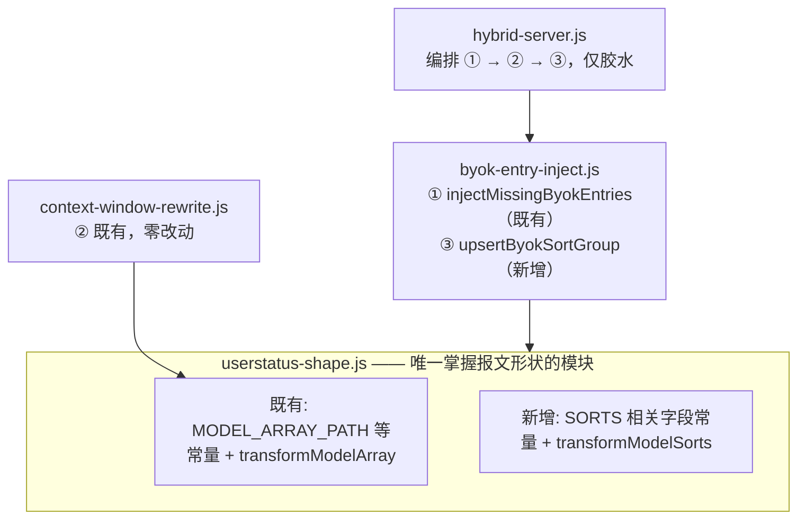

# BYOK sorts 白名单注入 — 设计文档

- **日期**: 2026-09-15
- **状态**: 设计已确认，待实现
- **前置证据**: 新版客户端（2026-09-15 更新）`sessions.desktop.main.js` 渲染代码逆向 + protobuf 字段定义逐层比对 + 注入模块真实载荷实测（4/4 注入成功）

## 背景

2026-09-15 凌晨 Devin Desktop 自动更新后，模型下拉列表中四个 BYOK 条目再次消失。与 2026-07-31 那次不同：本次三处补丁在位、请求链路连通（3006 TIME_WAIT 证实）、运行副本 2.6.0 注入功能完好、注入模块用 2026-07-31 真实载荷实测成功注入 4 条。

## 根因（已确认）

新版 Devin 把模型列表渲染从「遍历 `client_model_configs` 数组」改为「按 `client_model_sorts` 白名单渲染」：

```js
// sessions.desktop.main.js 中模型选择器转换逻辑（混淆名 mQl）
function mQl(r, o) {
  return {
    name: r.name,
    isDefault: r.name === "All" || r.name === "Recommended" || void 0,
    displayMetric: r.displayMetric ?? void 0,
    groups: r.groups.map(a => ({
      name: a.groupName,
      modelUids: a.modelLabels.flatMap(p => {
        let h = o.get(p);              // label → modelUid 字典查表
        return h === void 0 ? [] : [h] // ★ label 不在字典（或不在 labels 清单）即丢弃
      })
    })).filter(a => a.modelUids.length > 0)
  };
}
```

渲染分支（`r?.isDefault` 为真即 `name="All"` 的 sort）以 `r.groups[].modelUids` 驱动下拉列表分组；`client_model_configs` 里存在但未出现在任何 `modelLabels` 清单中的条目（含注入的 BYOK 条目）永不渲染。下拉列表中的 "Adaptive" / "Fusion" / "Recently Used" / "Recommended" 分组即来自该机制。

### protobuf 形状验证结论（新版客户端定义逐层比对）

| 层级 | 字段 | 新版状态 |
|------|------|----------|
| `GetUserStatusResponse` | f1=user_status | 未变 |
| `UserStatus` | f33=cascade_model_config_data | 未变（路径 `[1,33]` 仍有效） |
| `CascadeModelConfigData` | f1=client_model_configs | 未变（现有注入目标） |
| `CascadeModelConfigData` | **f2=client_model_sorts（新增消费）** | repeated ClientModelSort |
| `CascadeModelConfigData` | **f3=default_override_model_config（新增）** | optional |
| `ClientModelConfig` | f1=label / f22=model_uid | 未变 |
| `ClientModelSort` | f1=name(string), f2=groups(repeated ClientModelGroup) | 新形状 |
| `ClientModelGroup` | f1=groupName(string), f2=modelLabels(repeated string) | 新形状 |

另有次要发现：`isDefault` 语义为 `name === "All" || name === "Recommended"`；groups 经 `filter(modelUids.length > 0)` 过滤空组；sorts 数组全量 `.map()` 转换（非择一）。

## 目标与非目标

**目标**：在代理层向 `GetUserStatus` 响应的 `client_model_sorts` 白名单补入 BYOK 分组，使四个 BYOK 条目出现在默认视图中；与既有模型数组注入 ①、窗口改写 ② 串联生效。

**非目标**：不改前端 bundle；不改动其他 sort/group 的服务端内容；不处理 `default_override_model_config`。

## 关键设计决策

| 决策 | 选择 | 理由 |
|------|------|------|
| 注入位置 | `client_model_sorts` 内新建 `groupName="BYOK"` 独立分组 | 独立成组易辨识；UI 消费代码对 group 动态 push，无内置组名白名单 |
| 挂靠的 sort | 优先复用服务端已下发的 `name="All"` sort；无则新建整条 `{name:"All", groups:[BYOK组]}` | `name="All"` 是默认视图（isDefault），保证用户无需切换即可见 |
| label 来源 | 从既有 4 条模板 payload 解析出的 f1 label（单一来源导出） | 模型数组注入 ① 与 sorts 注入 ③ 的 label 必须逐字节一致，UI 按 label 查字典，错一字即丢弃 |
| 幂等性 | 已存在 `groupName="BYOK"` 组（在目标 sort 内）则跳过 | 重复请求/重放不产生重复组 |
| 形状知识归属 | 扩展 `userstatus-shape.js`（唯一掌握报文形状的模块） | 沿用 2026-07-31 设计确立的单一归属原则 |
| 失败语义 | 异常降级原样透传；`changed` 门控重压 | 沿用既有纪律 |

## 架构



## 数据流

```
Devin ──GetUserStatus──▶ hybrid-server（非流式分支）
   gzip magic 1f8b ──▶ tryGunzip
                         ▼
   ① injectMissingByokEntries       模型数组补 BYOK 条目（既有）
                         ▼
   ② rewriteUserStatusContextWindow 窗口改写（既有）
                         ▼
   ③ upsertByokSortGroup            sorts 白名单补 BYOK 分组（新增）
                         ▼
   任一 changed ──▶ gzipSync ──▶ 回传
   都没变       ──▶ 原 gzip 字节透传（零开销）
```

**为何 ③ 独立成趟而非并入 ①**：① 与 ③ 写的是 `CascadeModelConfigData` 下两个不同字段（f1 数组 vs f2 数组），失败模式不同（缺条目 vs 缺白名单分组），分别可诊断；且 ① 的 payload 回放含 `f23` opaque 结构，③ 的构造是纯新建消息，合并会让两者字节级语义纠缠。

## 模块职责

### 1. `src/proxy/handlers/userstatus-shape.js`（扩展）

- 新增常量：`CMCD_SORTS_FIELD = 2`、`SORT_NAME_FIELD = 1`、`SORT_GROUPS_FIELD = 2`、`GROUP_NAME_FIELD = 1`、`GROUP_LABELS_FIELD = 2`
- 新增 `transformModelSorts(decoded, handler)`：沿 `[1,33]` 下探到 `CascadeModelConfigData` 层，对 f2（repeated ClientModelSort）执行 handler 语义，契约与 `transformModelArray` 一致（`mapSort` / `appendSorts` 二选一，同传抛错，异常降级透传）
- 需要 `parseWithRaw` 支持 string 字段的无损重编（f1 name / f1 groupName / f2 modelLabels 均为 length-delimited，`writeBytesField` 已可复用）

### 2. `src/proxy/handlers/byok-entry-inject.js`（扩展）

- 新增导出 `BYOK_MODEL_LABELS`：从 `BYOK_ENTRY_TEMPLATES` 各 payload 解析 f1 label 得到（模块加载期一次性解析，作为单一来源）；① ③ 共用
- 新增 `upsertByokSortGroup(decoded)`：组合两趟 transform（handler 契约 mapSort/appendSorts 二选一，无法单趟同时改写与追加；RPC 低频，两趟代价可忽略）：
  1. **趟1 appendSorts**：回调收 `existingSortNames`；若其中无 `name === "All"` → 返回新建的完整 ClientModelSort（`{name:"All", groups:[BYOK组]}`，BYOK组 = `writeBytesField(GROUP_NAME_FIELD, "BYOK")` + 4 条 `writeBytesField(GROUP_LABELS_FIELD, label)`）；否则返回空数组
  2. **趟2 mapSort**：对每个 sort，若 `name === "All"` 且 groups 中无 `groupName === "BYOK"` 组 → 在 groups 尾部追加 BYOK 组并重建该 sort；否则返回 null（原样保留）
  3. 两趟各自幂等；任一 changed 即合并结果；返回 `{ buffer, changed, count }`（count = 追加的 sort 数 + 追加的组数）

### 3. `src/proxy/handlers/context-window-rewrite.js`（零改动）

### 4. `src/proxy/hybrid-server.js`（改造）

- `GetUserStatus` 分支串联 ① → ② → ③；任一 `changed` 则重压；仅胶水

## 错误处理

沿用既有纪律：

1. 每个 transform 顶层 try/catch，异常退化为原样透传
2. `changed` 门控——无实际改动则不重压，透传原 gzip 字节
3. 解析失败的层级原样保留
4. `BYOK_MODEL_LABELS` 加载期自检：与模板 f1 一致性校验，不一致者记日志并从 sorts 注入中剔除（模型数组注入 ① 的既有自检不变）

## 测试策略

| 文件 | 覆盖 |
|------|------|
| `userstatus-shape.test.mjs` | `transformModelSorts` round-trip 无损；appendSorts / mapSort 两种 handler；畸形输入不抛异常 |
| `byok-entry-inject.test.mjs` | sorts 为空→新建 All+BYOK 组；已有 All sort→组内追加；已有 BYOK 组→幂等字节不变；无 All sort 但有其他 sort→追加新 sort；label 与模板 f1 逐字节一致；畸形输入不抛异常 |
| 既有测试 | 必须全绿——重构安全网 |
| 组合测试 | ①→②→③ 串联后：数组含 4 条且 sorts 含 BYOK 组，注入条目 f18/f23.f4 改写生效，sorts 注入不干扰 ② |

不测真实网络 RPC，不测 UI 渲染（UI 行为以实机验证为准）。

## 风险

- **服务端 sorts 实际内容未知**（无法离线抓取当前载荷）：规则表已覆盖「有/无 All sort」两种情形；若服务端 sort 的 name 取其他值（非 "All"），③ 会追加新 sort，默认视图仍成立（新建的 name="All" 即 isDefault）
- **UI 对未知 groupName 的渲染**：消费代码动态 push 无校验，风险低；实机验证确认
- **模型列表存在其他入口**（如设置页、quick pick）走不同渲染路径：本次仅保证主选择器默认视图；实机验证时一并检查

## 实施约束

沿袭 2026-07-31 教训：手改运行副本会被整包覆盖，必须走 `pnpm run package` 产出 VSIX 正规安装。装完 VSIX 后需「一键启动 → 重载窗口 → 再一键启动」完成实测（重载会杀代理子进程）。

## 验收标准

1. `pnpm test` 全绿（含新增 sorts 用例）
2. VSIX 安装 + 重载窗口后，模型下拉列表默认视图出现 "BYOK" 分组及 4 个条目，可选中
3. 选中 BYOK 条目后聊天请求经代理按槽位路由（侧栏日志出现对应 `GetChatMessage` 与上游请求）
4. 侧栏日志出现 `🔄 GetUserStatus BYOK entries injected (x4)`，且无 sorts 相关报错